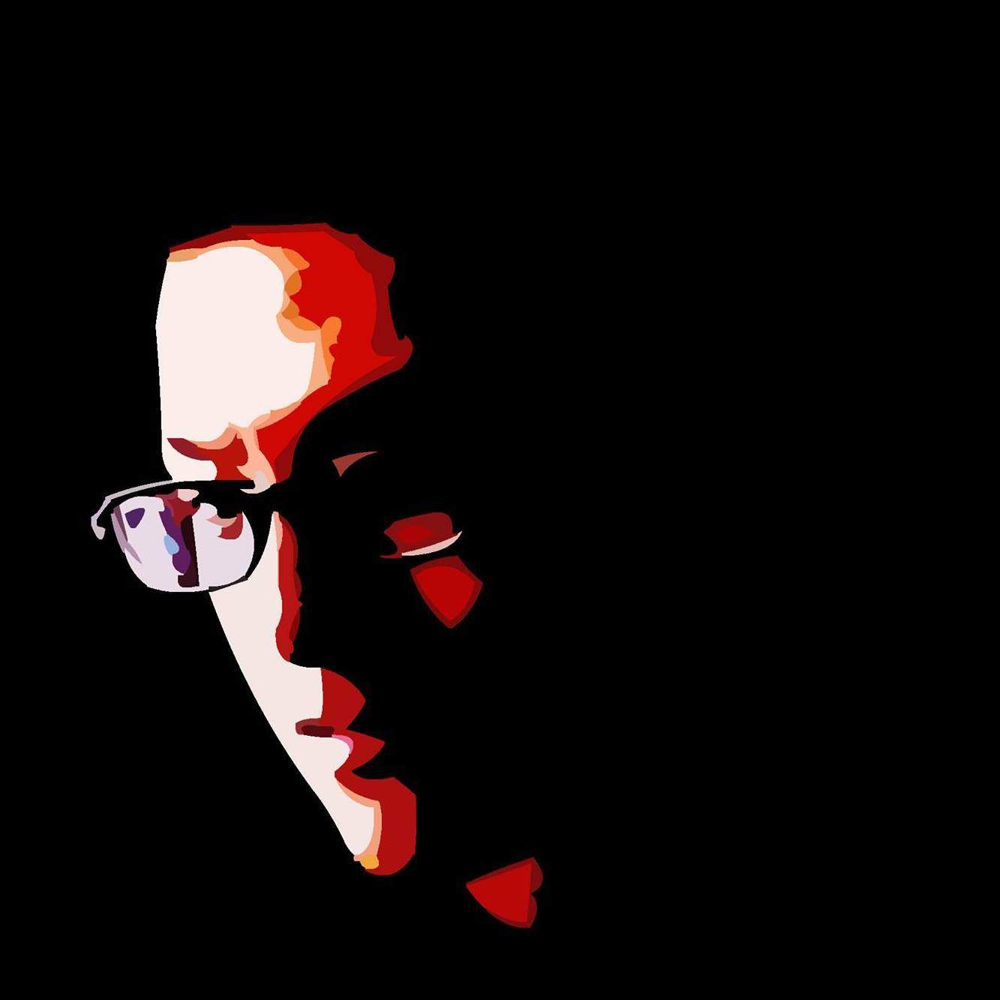
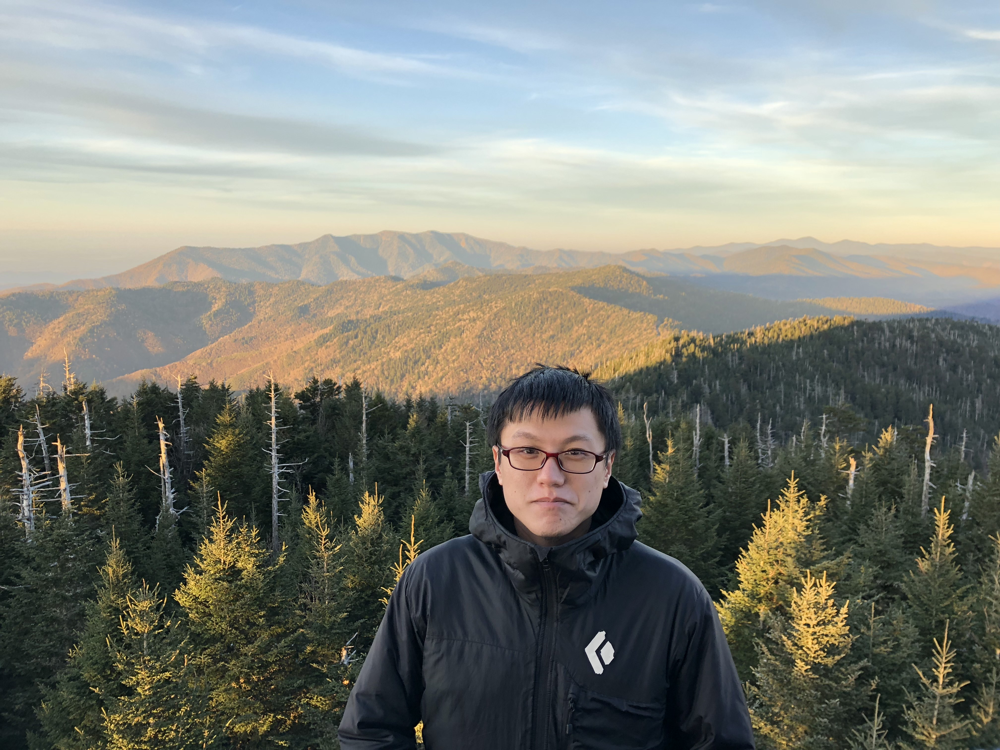

# Wei Chen

Hello, I am Wei.

I am experienced in Data Science, Data Engineering, Data Architect, and AI/ML implementation.

I graduated from National Taiwan University as a Master of Science in Biomedical Electronics and Bioinformatics.
 
I worked in RIKEN Brain Science Institute in Japan and Stanford University in the U.S. as a research assistant.
 
I joined a startup for 5 years, developed a software system and led a team to sell it to 5 mobile operators in 3 countries.
 
I then joined a large healthcare IT company in the U.S. for a year and built a healthcare data-lake.

Currently, I am a Sr. Data Scientist in Amazon Web Services, building AI/ML applications for our customers.

Please feel free to contact me!

## CONTACT

 - Phone: [+886-988-153-817](tel:886-988-153-817)

 - Email: [weichen@apache.org](mailto://weichen@apache.org)

 - Github: [Wei-1](https://github.com/Wei-1)
 
 - Linkedin: [wei-chen-39546218](https://www.linkedin.com/in/wei-chen-39546218/)

## EXPERIENCE, EDUCATION, and SKILL

 - [CV Link](CV.pdf)

 - [Papers Link](https://github.com/Wei-1/Wei-1.github.io/blob/master/PAPERS.md)
 
 - [Certifications](https://github.com/Wei-1/Wei-1.github.io/tree/master/certification)

## THINGS NOT in CV

 - Ping-Pong School Team (6 Years)

 - Certificated Beach Patrol, Lifeguard

 - Science Fiction Lover

 - Also play Basketball, Badminton, and Soccer

## HELLO

<!---
Photo Credit to Raja Panakati, my colleague in ChangeHealthcare
Great Smoky Mountain - 2018-11-03
-->
